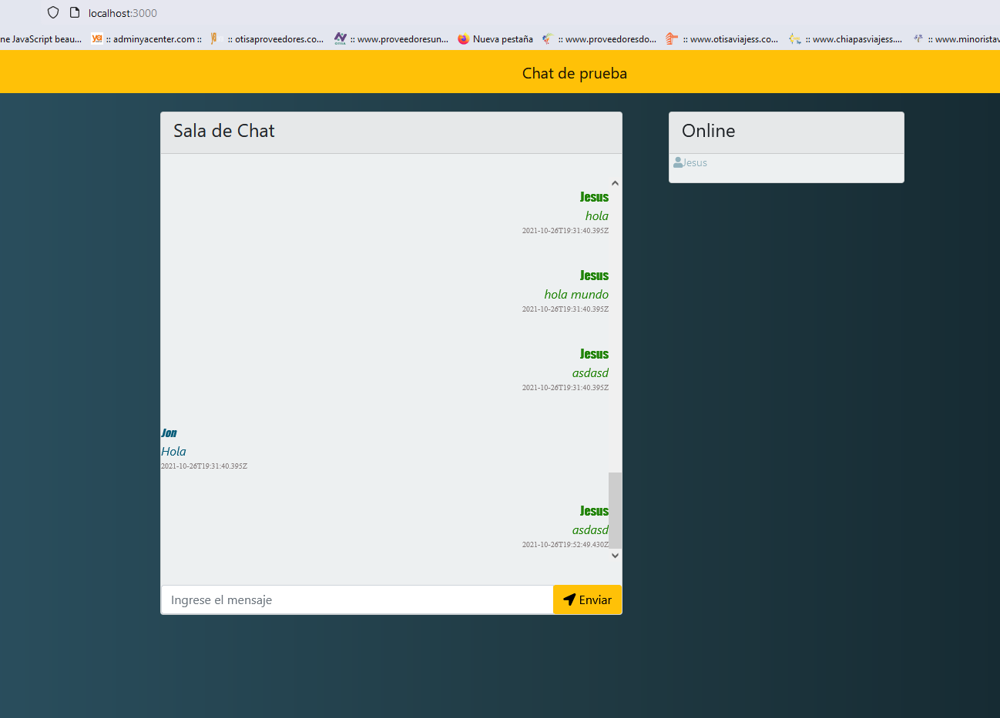

# Sala de Chat
Este chat es de prueba, desarrollado para test.

# Técnologias Usadas
- Nodejs
  - Express
  - Socket.io
  - Mongoose
  - nodemon (para entorno de desarrollo)
  - Vuejs
  - JavaScript
- HTML5
- Mongodb
- CSS
    - Sass
    - Bootstrap

# Biblioteca adicional
- https://kit.fontawesome.com/1322648feb.js
- https://cdn.jsdelivr.net/npm/vue@2.5.16/dist/vue.js

# Recomendaciones

- Tener instalado nodejs V12 o superior.
- Tener Instalado MongoDB.
- Visual Studio Code (Sugerencia).

- Descargar el repositorio.
- Ejecutar npm ci. (para instalar los archivos necesarios en la carpeta node_modules ya que lo tengo omitido en el repositorio)
- para compilar el proyecto ejecutar npm run dev.